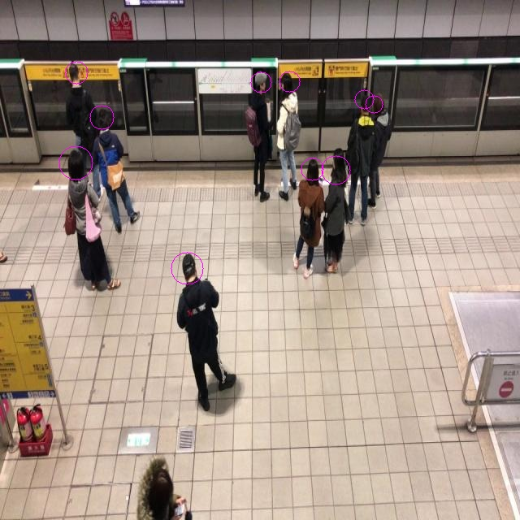
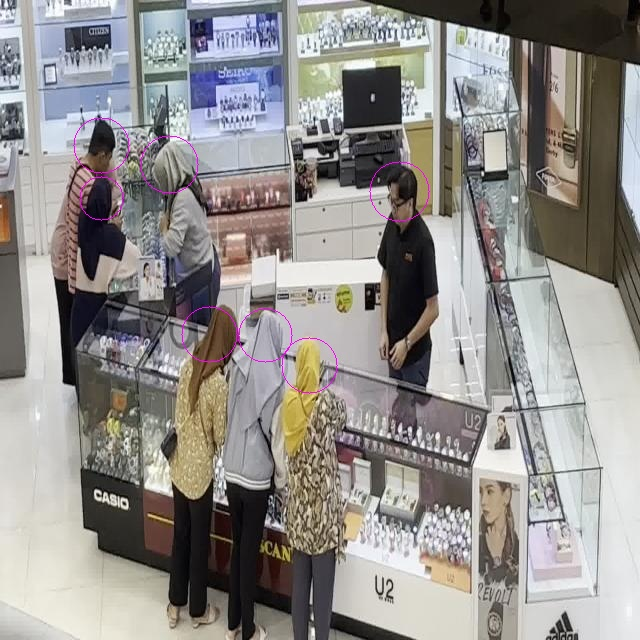
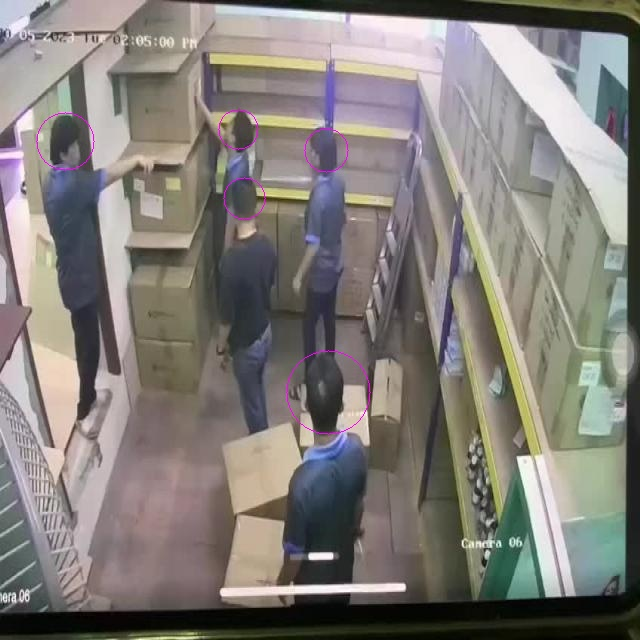
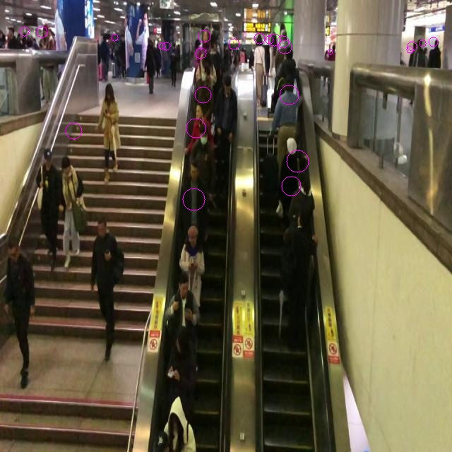
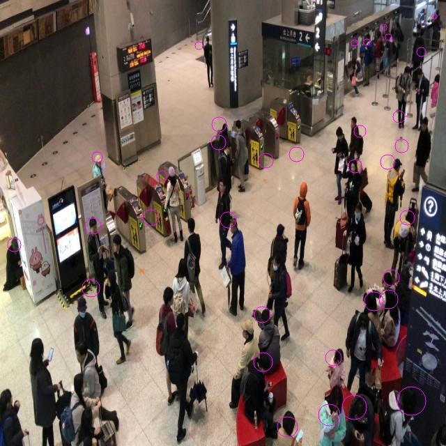
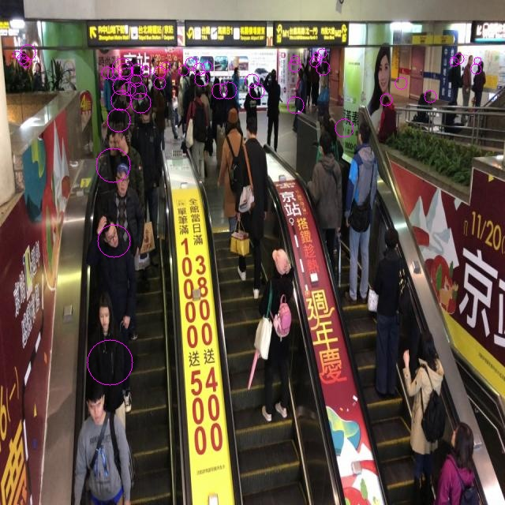

# Head Detector

A YOLOv3 based neural network to detect heads of people on security cameras 🙆

## Examples





## Average precision

* Validation set — 0.7449.
* Test set — 0.7285.

Dataset — [Head Detection CCTV](https://universe.roboflow.com/trisha-then/head-detection-cctv/dataset/4).  
Download the weights — [Google Drive](https://drive.google.com/file/d/1xnfrCR4iCszs3kO9OJu5UmGuk7lJCWPe/view?usp=sharing).

## Approach

* The original [YOLOv3 architecture](https://arxiv.org/pdf/1804.02767) was used.
* Since we only need to predict one class, class scores were dropped from the predictions, so the model only needs to learn the confidence score.
* Rectangular anchor boxes were replaced with circles since this shape is suitable for heads and requires the model to learn only one parameter (diameter) instead of two (hight and width).
* The size of the anchor diameters were identified applying the K-Means clustering algorithm on the train set.
* The model was trained on top of the original [YOLOv3 weights](https://pjreddie.com/darknet/yolo/) for the COCO dataset.

## Known Limitations

The model doesn't perform well if there are many objects on the image.





## Setup

Download and enter the project:

```zsh
git clone https://github.com/eakriulin/head_detector.git
cd head_detector
```

Create and activate the virtual environment

```zsh
python3 -m venv .venv
source .venv/bin/activate
```

Install dependencies

```zsh
pip3 install -r requirements.txt
```

Download [the weights](https://drive.google.com/file/d/1xnfrCR4iCszs3kO9OJu5UmGuk7lJCWPe/view?usp=sharing) and put them into the project folder.

## Run

```zsh
python3 image.py /path/to/my/image.jpg
```
